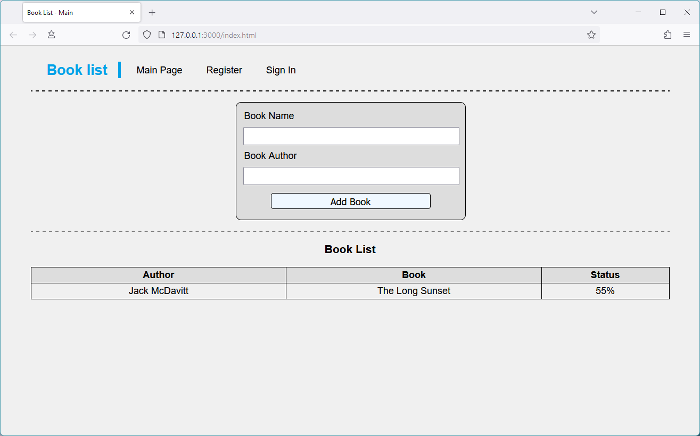
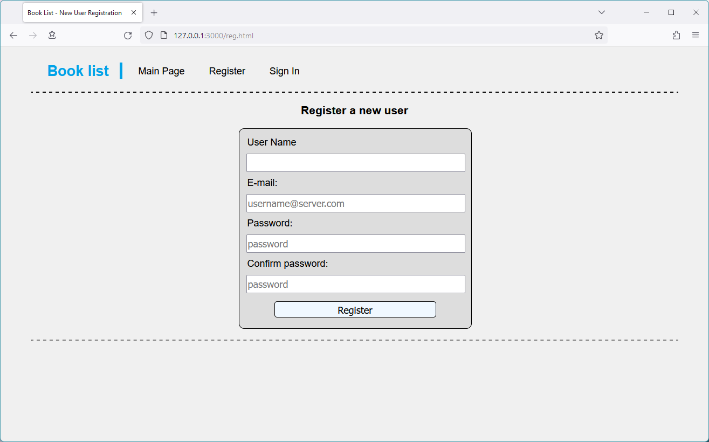
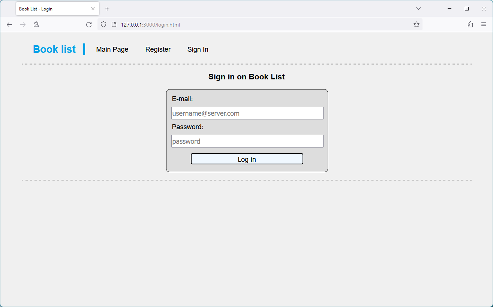

## Лабораторная работа №3
### Скриншоты

На всякий случай

### Ответы на вопросы

#### 1. Что такое лендинг?
Лендинг-пейдж (от англ. landing page), или просто лендинг, — это посадочная страница, на которую пользователи попадают через рекламу в социальных сетях. Сайт-лендинг знакомит пользователя с продуктом или услугой. Задача страницы — побудить человека выполнить целевое действие: купить, подписаться на рассылку, получить лид-магнит, оставить заявку.

#### 2. Что такое SPA, MPA и PWA?
SPA (Single-Page Application) – одностраничное приложение. Это веб-приложение или веб-сайт, использующий единственный HTML-документ как оболочку для всех веб-страниц и организующий взаимодействие с пользователем через динамически подгружаемые HTML, CSS, JavaScript, обычно посредством AJAX.

MPA (Multi-Page Application) – многостраничное приложение. Оно работает по традиционной схеме. Это означает, что при каждом незначительном изменении данных или загрузке новой информации страница обновляется. Такие приложения тяжелее, чем одностраничные, поэтому их использование целесообразно только в тех случаях, когда нужно отобразить большое количество контента.

PWA (Proggessive Web App) – прогрессивное web-приложение. Это технология в web-разработке, которая визуально и функционально трансформирует сайт в приложение (мобильное приложение в браузере).

#### 3. Почему лучше разбирать сразу фреймворк, а не чистый JS?
Фреймворк значительно упрощает разработку приложений, поскольку содержит множество часто используемых функций, которые в противном случае пришлось бы реализовывать самостоятельно. Но для понимания процессов, происходящих внутри фреймворка, необходимо знать хотя бы базовый JavaScript.

#### 4. Roadmap frontend что это и можно ли стать фронтенд специалистом за один 30-минутный видос на ютубе?
Roadmap frontend - детальный пошаговый план действий, описывающий процесс развития навыков веб-разработчика. Он содержит основные темы, которые необходимо изучить и применить на практике. 
Нельзя стать frontend-специалистом за один 30-минутный видео-урок на YouTube, поскольку за такое короткое время невозможно покрыть все основные навыки, требуемые frontend-разработчику.

#### 5. Что такое принципы S.O.L.I.D, KISS и YAGNI?
S.O.L.I.D. – основные принципы объектно-ориентированного программирования и проектирования: 

S (Single Responsibility Principle) – принцип единой/единственной ответственности; 
O (Open-Closed Principle) – принцип открытости-закрытости; 
L (Liskov Substitution Principle) – принцип подстановки Барбары Лисков; 
I (Interface Segregation Principle) – принцип разделения интерфейсов; 
D (Dependency Inversion Principle) – принцип инверсии зависимости; 

KISS (от англ. "Keep it simple, stupid!") – принцип проектирования, утверждающий, что большинство систем работают лучше всего, если они остаются простыми, а не усложняются. Поэтому в области проектирования простота должна быть одной из ключевых целей и следует избегать ненужной сложности.

YAGNI (от англ. "You aren't gonna need it") – процесс и принцип проектирования ПО, при котором в качестве основной цели и/или ценности декларируется отказ от избыточной функциональности, то есть отказ добавления функциональности, в которой нет непосредственной надобности.

#### 6. Для чего OWASP и CORS?
OWASP (Open Web Application Security Project) – это открытый проект обеспечения безопасности веб-приложений, созданный и поддерживаемый некоммерческой организацией OWASP Foundation. Сообщество работает над созданием статей, учебных пособий, документации, инструментов и технологий, находящихся в свободном доступе. Участники сообщества OWASP делают приложения безопаснее, учитывая человеческий фактор и технологический уровень. Эксперты организации каждые 3–4 года обновляют OWASP Top Ten – список критических уязвимостей веб-приложений. Он помогает разработчикам и специалистам по информационной безопасности создавать и поддерживать безопасные сайты и приложения.

CORS (Cross-Origin Resource Sharing) – технология современных браузеров, которая позволяет предоставить веб-страницам доступ к ресурсам другого домена. Это стандарт, позволяющий предоставлять веб-страницам доступ к объектам сторонних интернет-ресурсов. Сторонним считается любой интернет-ресурс, который отличается от запрашиваемого протоколом, доменом или портом. Доступ предоставляется по специализированным запросам. Интернет-ресурс, принимающий запрос, содержит список доверенных источников, которым разрешен доступ к объектам. Страница-источник запроса получает доступ, если входит в список доверенных источников. 